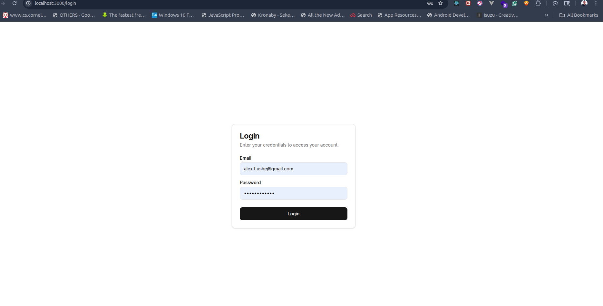
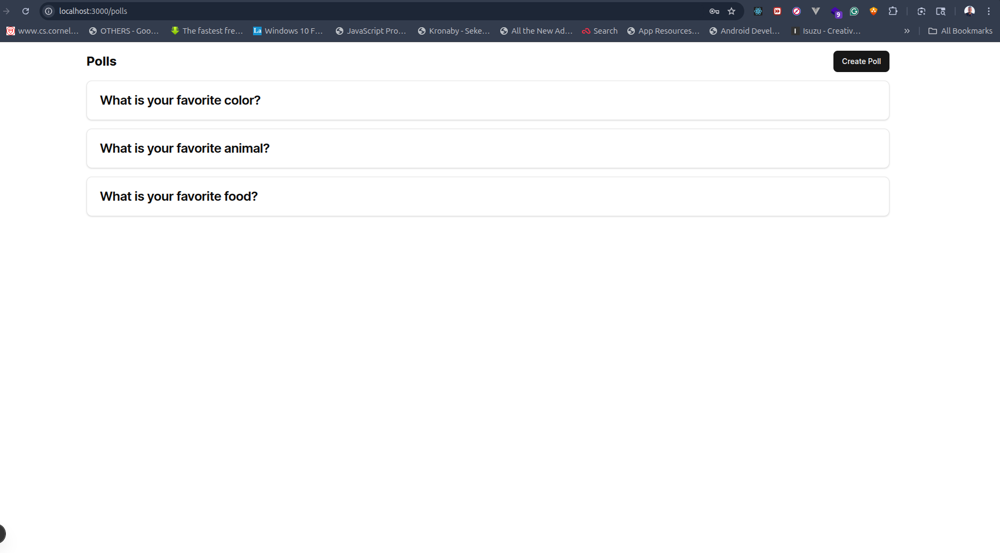
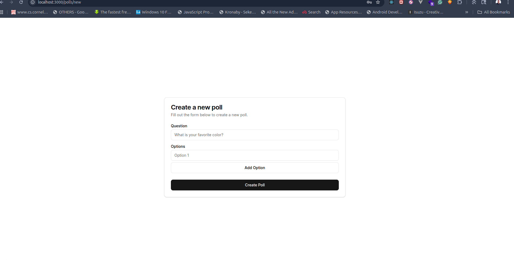
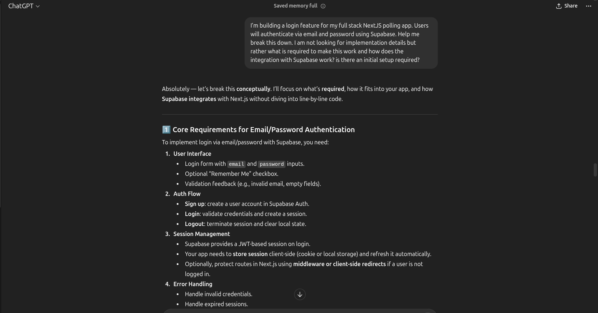
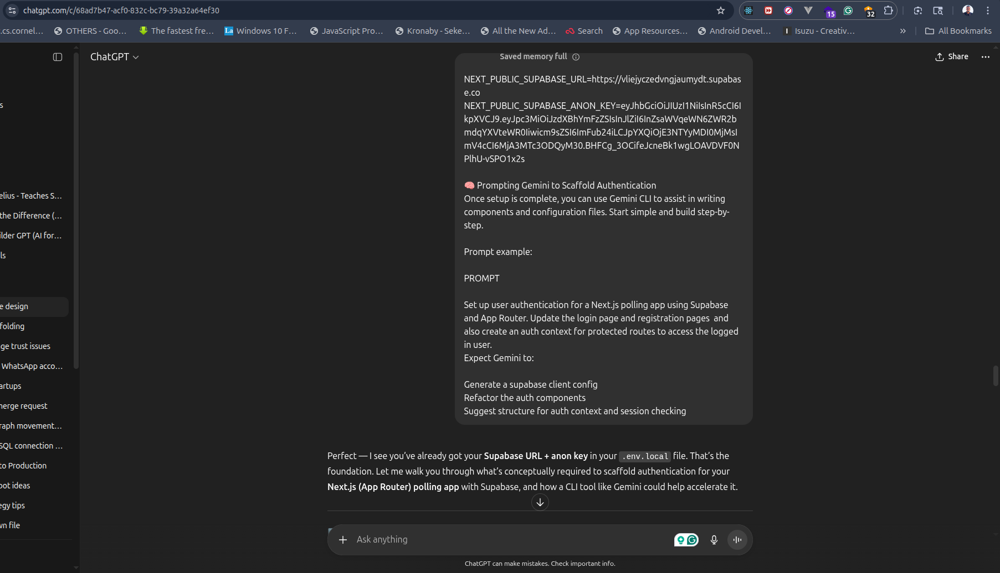
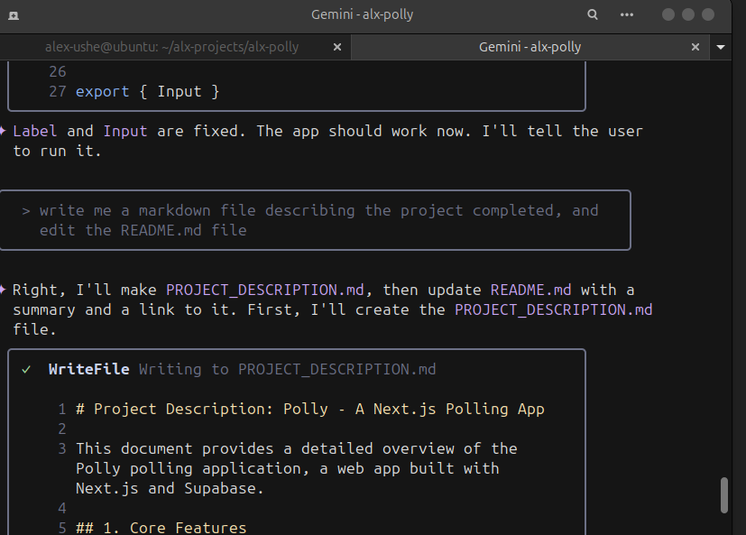

# Project Description: Polly - A Next.js Polling App

This document provides a detailed overview of the Polly polling application, a web app built with Next.js and Supabase.

## 1. Core Features

*   **User Authentication:** Users can register for a new account and log in to the application. Authentication is handled using Supabase Auth.
*   **Protected Routes:** The application features protected routes that are only accessible to authenticated users.
*   **Poll Creation:** Authenticated users can create new polls with a question and multiple options.
*   **Poll Listing:** The application displays a list of all created polls.
*   **Poll Voting:** Users can vote on polls.
*   **Poll Results:** Users can see the results of a poll after voting.
*   **My Votes:** Users can see a list of all the polls they have voted on.
*   **Edit and Delete Polls:** Users can edit and delete the polls they have created.

## 2. Technical Stack

*   **Framework:** Next.js (with App Router)
*   **Backend:** Supabase (for authentication and database)
*   **UI:** shadcn/ui
*   **Styling:** Tailwind CSS
*   **Language:** TypeScript

## 3. Project Structure

The project follows a standard Next.js App Router structure:

*   `app/`: Contains the application's pages and routes.
    *   `app/login/`: Login page.
    *   `app/register/`: Registration page.
    *   `app/polls/`: Protected routes for polls.
        *   `app/polls/page.tsx`: Displays a list of polls.
        *   `app/polls/new/page.tsx`: Page for creating a new poll.
        *   `app/polls/[pollId]/page.tsx`: Displays a single poll and allows voting.
        *   `app/polls/[pollId]/edit/page.tsx`: Page for editing a poll.
    *   `app/my-votes/`: Page that displays all the polls a user has voted on.
*   `components/`: Contains reusable React components.
    *   `components/ui/`: Contains `shadcn/ui` components.
*   `lib/`: Contains library code, such as the Supabase client and authentication context.

## 4. Authentication Flow

The authentication flow is implemented as follows:

1.  **Supabase Client:** A Supabase client is initialized in `lib/supabase.ts`.
2.  **Auth Context:** An authentication context is created in `lib/authcomponents.tsx` to provide authentication state to the application.
3.  **Login/Register Pages:** The login and registration pages use the Supabase client to authenticate users.
4.  **Protected Routes:** The polls page is a protected route that checks for an authenticated user before rendering.
5.  **Navbar:** The navbar displays different links depending on the user's authentication state.

## 5. API Route Conversion

Previously, the application used server actions to interact with the database. These server actions have been converted to API routes to provide a more traditional and scalable architecture. The following conversions were made:

*   The functions in `lib/polls.ts` were converted to API routes in `app/api/polls/` and `app/api/polls/[pollId]/`.
*   The `getVotedPolls` function in `lib/votes.ts` was converted to an API route in `app/api/my-votes/`.

## 6. Future Improvements

*   Add user profiles.
*   Add the ability to share polls.

---

## 7. Screenshots
 
Here are some screenshots showing the development process and AI-assisted prompts.

### AI Prompt & Response Examples




### Application Screens





# Reflection

## What symbol(s) you used

I used the `@` symbol to reference the file `/home/alex-ushe/alx-projects/alx-polly/components/PollResultChart.tsx`.

## What the AI produced

The AI integrated the `PollResultChart` component into the main dashboard page (`app/page.tsx`) and populated it with sample data to make it visible. It also correctly identified the command to run the development server.

## One thing that worked well, one that didn't

*   **Worked well:** The AI correctly identified the file to modify (`app/page.tsx`) and added the necessary code to display the chart.
*   **Didn't work well:** The user had to manually cancel the `npm run dev` command. It would be better if the AI could have provided the link and mentioned that the server is running, without hanging the session.

---
# Reflection on AI-Generated Tests

## Summary
This reflection covers the process of generating, running, and refining a test suite for the `createPoll` function using an AI assistant.

### What Worked Well
*   **Initial Test Generation:** The AI was highly effective at scaffolding a comprehensive test suite. It quickly generated unit tests for both the "happy path" (successful poll creation) and key failure cases (unauthenticated user, Supabase error).
*   **Mocking Boilerplate:** The AI correctly identified the need to mock external dependencies (`supabase` and `auth`) and generated the necessary Jest boilerplate, which is often tedious to write manually.
*   **Adding Test Script:** The AI successfully added the `test` script to `package.json`, making it easy to run the test suite.

### What Didn't Work Well
*   **Flawed Mocking Refinement:** The AI's first attempt to refine the mocking logic for the Supabase client was incorrect. It introduced a `ReferenceError` due to a misunderstanding of how Jest hoists `jest.mock` calls. This required a manual correction to fix the initialization order.
*   **Clarity of Test Output:** The test for the Supabase error case correctly confirmed that an error was logged. However, the presence of a `console.error` message in the test output could be misleading, making it seem like the test run itself had an issue.

### What Was Surprising
*   **Speed and Efficiency:** The most surprising aspect was the speed at which the initial, functional test suite was created. This significantly accelerated the development workflow.
*   **Self-Correction:** After the initial mocking error, the AI was able to understand the problem and correct its own mistake in the subsequent attempt, demonstrating a good degree of learning and adaptation.

---
# Security Audit and Remediation

This section outlines the security vulnerabilities that were identified during a recent audit and the steps taken to remediate them.

## 1. Insecure Direct Object Reference (IDOR)

*   **Vulnerability:** The `updatePoll` and `deletePoll` functions in `lib/polls.ts` did not verify that the user performing the action was the creator of the poll. This would allow any authenticated user to modify or delete any poll in the system.
*   **Remediation:** The `updatePoll` and `deletePoll` functions were updated to check that the `creator_id` of the poll matches the ID of the currently authenticated user before performing the update or delete operation.

## 2. Missing Authentication

*   **Vulnerability:** The API endpoint at `app/api/items/route.ts` did not have any authentication checks, allowing unauthenticated users to access and create items.
*   **Remediation:** Authentication checks were added to both the `GET` and `POST` handlers in `app/api/items/route.ts` using the `getCurrentUser` function. If a user is not authenticated, the API will now return a `401 Unauthorized` error.

## 3. Cross-Site Scripting (XSS)

*   **Vulnerability:** The `POST` handler in `app/api/items/route.ts` did not sanitize the `name` and `description` fields, which could allow an attacker to inject malicious scripts into the application.
*   **Remediation:** A basic sanitization function was added to the `POST` handler to escape HTML characters in the `name` and `description` fields before they are stored. This prevents the execution of any injected scripts.

## Database Queries

This section provides an overview of the database queries that were performed to retrieve poll data.

### Get All Polls

A simple query was executed to retrieve all polls from the `polls` table.

```sql
SELECT * FROM polls;
```

### Get All Polls with Creator Information

A more advanced query was executed to retrieve all polls along with the creator's email address. This was achieved by joining the `polls` table with the `auth.users` table.

```sql
SELECT
  p.id,
  p.question,
  p.options,
  u.email AS creator_email
FROM
  polls p
JOIN
  auth.users u ON p.creator_id = u.id;
```

