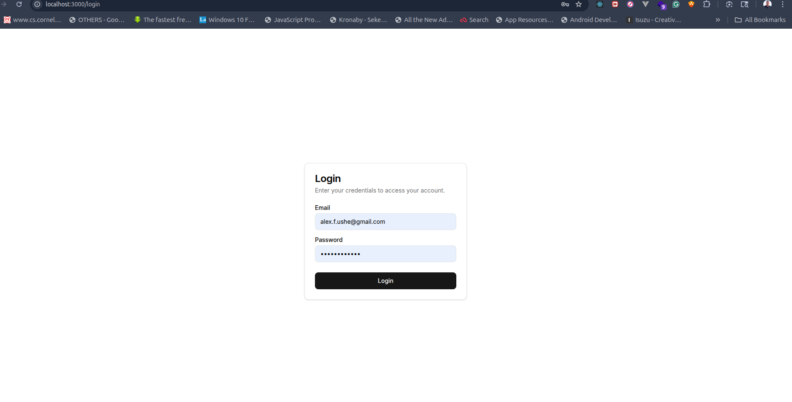
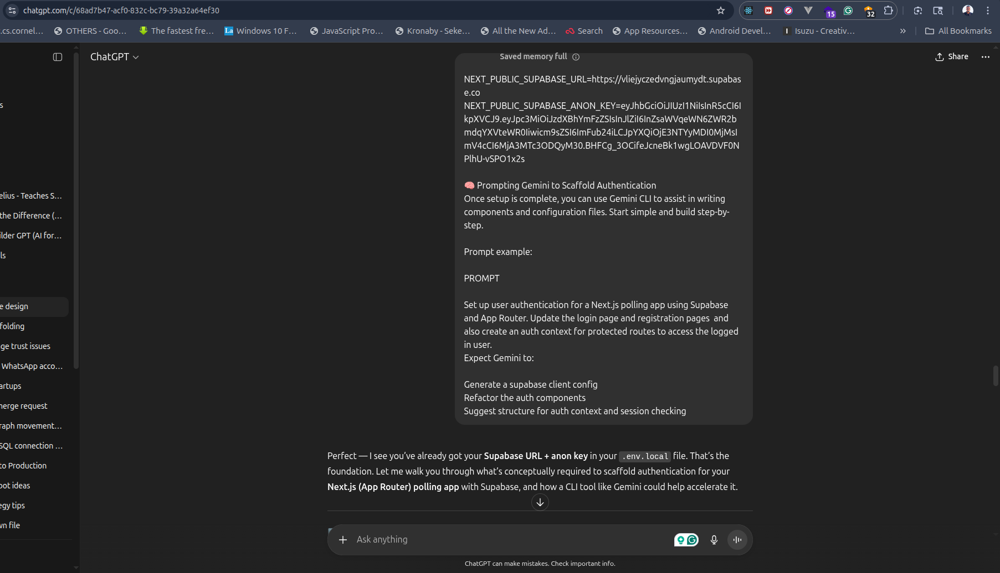

# Project Description: Polly - A Next.js Polling App

This document provides a detailed overview of the Polly polling application, a web app built with Next.js and Supabase.

## 1. Core Features

*   **User Authentication:** Users can register for a new account and log in to the application. Authentication is handled using Supabase Auth.
*   **Protected Routes:** The application features protected routes that are only accessible to authenticated users.
*   **Poll Creation:** Authenticated users can create new polls with a question and multiple options.
*   **Poll Listing:** The application displays a list of all created polls.

## 2. Technical Stack

*   **Framework:** Next.js (with App Router)
*   **Backend:** Supabase (for authentication and database)
*   **UI:** shadcn/ui
*   **Styling:** Tailwind CSS
*   **Language:** TypeScript

## 3. Project Structure

The project follows a standard Next.js App Router structure:

*   `app/`: Contains the application's pages and routes.
    *   `app/login/`: Login page.
    *   `app/register/`: Registration page.
    *   `app/polls/`: Protected routes for polls.
        *   `app/polls/page.tsx`: Displays a list of polls.
        *   `app/polls/new/page.tsx`: Page for creating a new poll.
*   `components/`: Contains reusable React components.
    *   `components/ui/`: Contains `shadcn/ui` components.
*   `lib/`: Contains library code, such as the Supabase client and authentication context.

## 4. Authentication Flow

The authentication flow is implemented as follows:

1.  **Supabase Client:** A Supabase client is initialized in `lib/supabase.ts`.
2.  **Auth Context:** An authentication context is created in `lib/authcomponents.tsx` to provide authentication state to the application.
3.  **Login/Register Pages:** The login and registration pages use the Supabase client to authenticate users.
4.  **Protected Routes:** The polls page is a protected route that checks for an authenticated user before rendering.
5.  **Navbar:** The navbar displays different links depending on the user's authentication state.

## 5. Future Improvements

*   Implement the logic to actually create a poll and store it in the database.
*   Implement the logic to fetch and display real polls from the database.
*   Build the poll voting page.
*   Add user profiles.
*   Add the ability to share polls.

---

## 6. Screenshots

Here are some screenshots showing the development process and AI-assisted prompts.

### AI Prompt & Response Examples

### Application Screens

